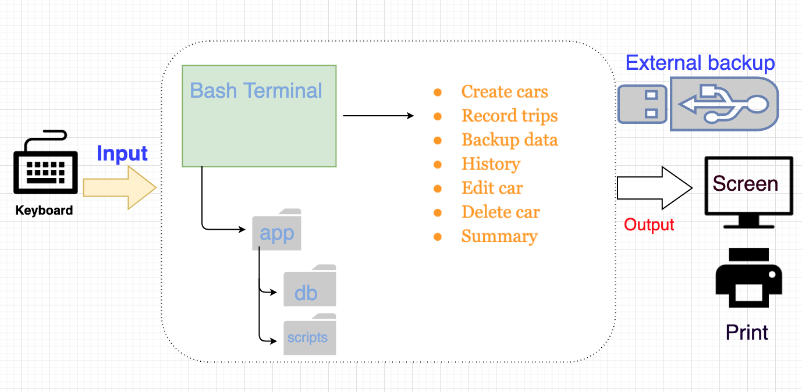
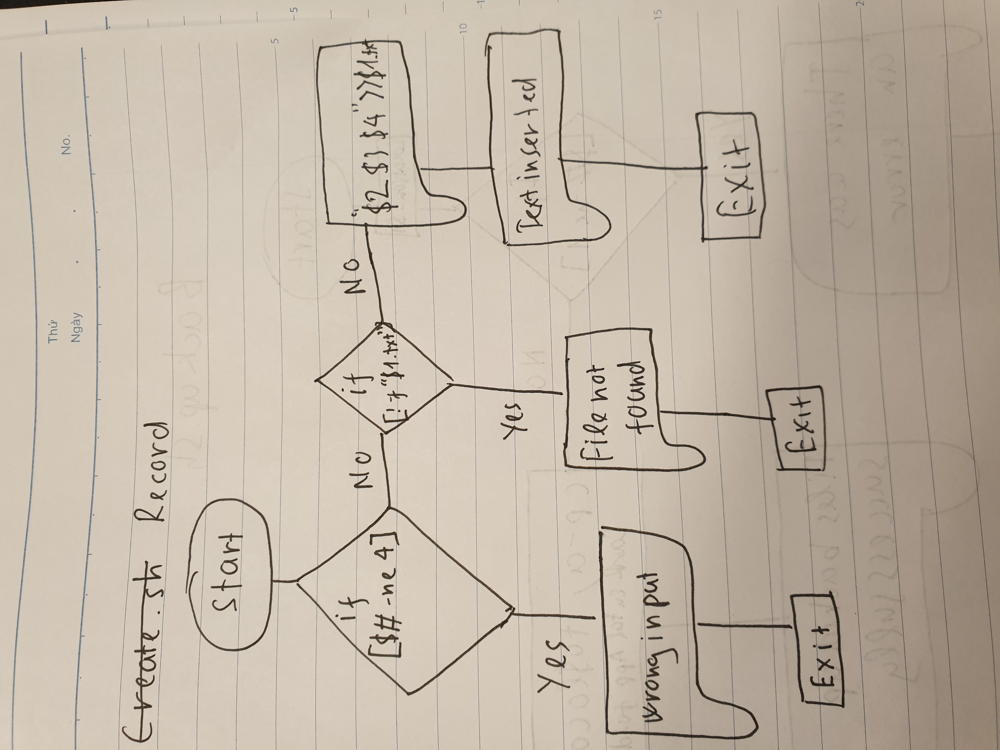
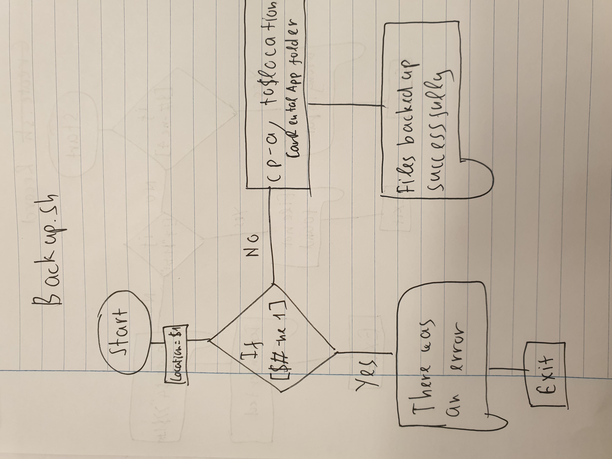
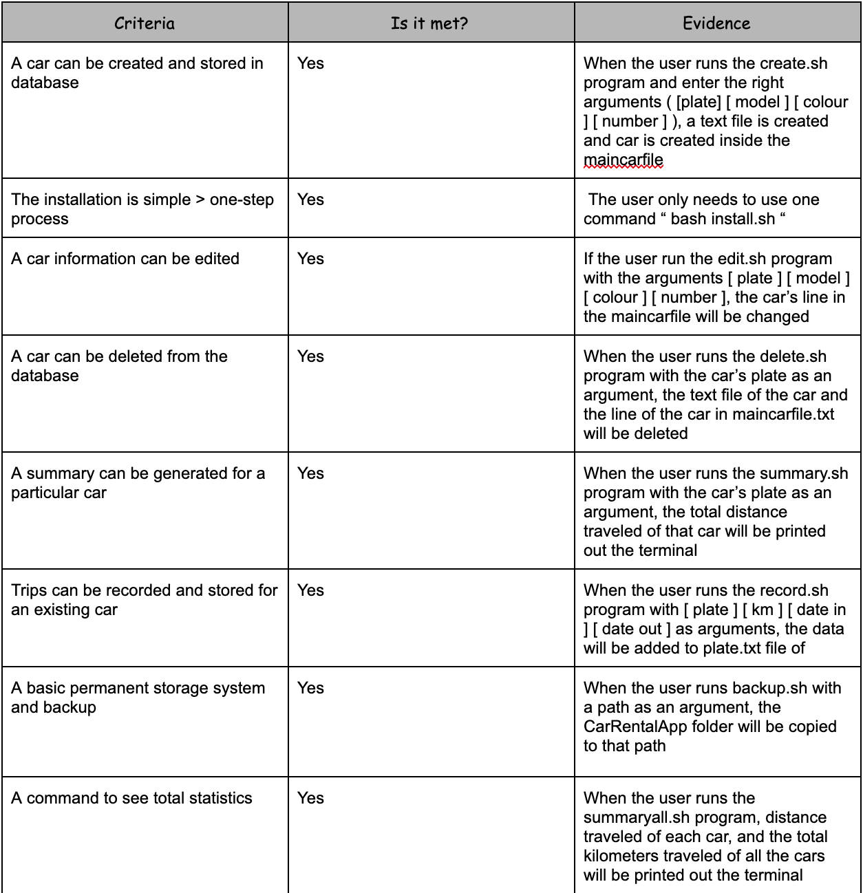

Car Rental Minimal App
===========================

A car rental management minimal app in Bash.

Contents
-----
  1. [Planning](#planning)
  1. [Design](#design)
  1. [Development](#development)
  1. [Evaluation](#evaluation)

Planning
----------

### Defining the problem (Topic 1.1.1)
Mr. A, an owner of very big car rental shop downtown has had some problems with data. He opened as a very small shop with only him and his wife working in the factory, but as there are more people knowing about the shop, it gained a significant amount of customers. His wife is taking care of manually keeping track of the customer car data, but as there is a huge amount of people, making very hard to do it manually


### Solution proposed
In this project, we are trying to create a new system for a car rental shop in which they can manage the users' data more easily and sufficiently. I decided that choosing a bash program would be the best solution for Mrs.vx because of the complexity of the problem and also the simplicity of the program. They wanted to purchase a computer program collecting basic information about the distance driven for each car, and also other data. The want the program to be a simple and transparent based proram, that contains easy commands that allow to create a car, or record a trip; also it should include a command to see total statistics of the data. In that way, without having solid knowledge of computing, the owner can still use the program sufficiently. Lastly, there should be a backup system so if the user somehow lost the data, or the computer 's drive is accidentally wiped, we can still have it afterwards.


### Success Criteria

These are measurable outcomes
1. A car can be created and stored in the database
1. A car information can be edited
1. A car can be deleted from the database
1. The installation is ***simple-> one step process*
1. A summary (total/average distance traveled) can be generated for a particular car
1. Trips can be recorded and stored for an existing car
1. A basic database system is implemented
1. A basic backup functionality is available

Design
---------
### Overall sketch of the system:

System diagram explanation: all the user need to do is installing the the program and start running it. All the data of the cars and the trips are entered by the user and that is the input. Using the program in the scripts folder, the computer will process the data and show the output to the user through terminal. There will also be a backup system and the user can choose where to put the backup file, for problems like data loss.
### Testing plan of the program

This program shows the testing plan/steps of the program, do this when the program is complete to see if it is functioning thouroughly


Development
--------
### 1. Install program
Steps:
1) Move to desktop
2) Create the CarRentalApp folder
3) Go inside the folder and install the neccessary folders ( db, scripts, test ) 
The following script creates the app folder and inside it creates two more folders
````.sh
#!/bin/bash

#This file creates the folder structure for the 
#minimal Car Rental app
    cd ~/Desktop
    mkdir CarRentalApp
    cd CarRentalApp
    mkdir db 
    mkdir scripts
    cp -r ~/Desktop/CarApp/scripts/. ~/Desktop/CarRentalApp/scripts
#Create App folder

echo "Structure created successfully"
````
The folder is defaultly located in desktop for the user to have easy access to it. The only long code I used in this program is 
````.sh
cp -r ~/Desktop/CarApp/scripts/. ~/Desktop/CarRentalApp/scripts
```` 
this is the copy commands that copy everything that inside a folder to another folder. By moving everything that it contains, we use "-r"

### 2. Create car
Steps:
1) Get the input from the user
2) Check if there are 4 arguments (License Brand Color Num_of_seats )
3) Write to main file a line with those arguments
4) Create a "License".txt file
````.sh
#!/bin/bash
# This program creates a new car file for the user
if  [ $# -ne 4 ]; then
    echo "Wrong input"
    exit
else 
echo "$1 $2 $3 $4" >> ~/Desktop/CarRentalApp/db/Maincarfile.txt
echo -n "" > ~/Desktop/CarRentalApp/db/$1.txt
fi
bash frame.sh "File created successfully"
````
The only difficulty I encountered was how to add lines to a text file without deleting the lines that are already in it, but I simply found the solution that we can use "echo >> " instead of "echo > " ( which will rewrite the whole file )


### 3. Edit
Steps:
1) Check if the user enter enough arguments
2) Check if the car we want to edit exists
3) Locate the line with the license in the maincarfile.txt
4) Rewrite the line with the arguments the user just entered
````.sh
 bash#!/bin/bash
#This program edit the information of an exiting car in the
#maincarfile
#user enters [license place] [model] [red] [pp]

if [ $# -ne 4 ]; then
  echo "Error with the number of arguments"
  echo "Enter License Maker Model Passengers"
  exit
fi

license=$1
maker=$2
model=$3
pp=$4

cd ../db

if [ ! -f "$license.txt" ]; then
  echo "File not found!"
fi

#find the line with the given car plate and delete it
sed -i '' "/^$license/d" maincarfile.txt
#add the new information
echo "$license $maker $model $pp" >> maincarfile.txt
cd ../scripts
bash frame.sh "Car edited successfully"
````
In this program, there is a very hard command called sed -i. It looks very complicated but it is very helpful, it helps to locate the line with containing the word that you need to find. I finds this confusing at first because I don't know what the word in that command means, but then I did research only and finally know.
````.sh
#find the line with the given car plate and delete it
sed -i '' "/^$license/d" maincarfile.txt
````

### 4. Record
Steps:
1) Move to the database folder
2) Check if the number of arguments is 4
3) Check if the car exists
4) Add the distance traveled, date in, date out in the argument to the "license".txt file
````.sh
#!/bin/bash
# This program records the information of a chosen car by the user
cd ~/Desktop/CarRentalApp/db
if [ $# -ne 4 ]; then
	echo "Wrong input"
	exit
elif [ ! -f "$1.txt" ]; then
	echo "File not found!"
	exit
else 
echo "$2 $3 $4" >> $1.txt
cd ../scripts
bash frame.sh "text inserted"
fi
````
````.sh
echo "$2 $3 $4" >> $1.txt
````
I encountered no problem writing this program. The only reminder is that to again use echo >>. This is because the user wants to enter multiple data to a car ( different trips for a car ), thats why instead of rewriting the whole file, we have to keep adding in new lines.
````.sh
if [ $# -ne 4 ]; then
	echo "Wrong input"
	exit
````
This command check if the number of arguments the user entered is 4. "$#" is the number of arguments, if it is not equal to 4 than the if command will run, printing out "Wrong input" to the terminal and exit the program
````.sh
if [ ! -f "$1.txt" ]; then
	echo "File not found!"
	exit
````
This command is used to check if a file exist in that directory. By adding the quotation mark "!", the if command means that if the file DOES NOT exist, then the command it will terminate the commands inside if.


### 5. Summary
Steps:
1) Check if the number of arguments is 1
2) Check if the car exists
3) Read the file, while adding all the kilometeres traveled in each line together
4) Print out the terminal the total distance traveled of that car
````.sh
#!/bin/bash
# This script check the summary of a particular car

cd ~/Desktop/CarRentalApp/db
# This program gives the summary ( total distance travelled ) of a car chosen by the user
s=0
# checks number of arguments
if [ $# -ne 1 ]; then
  echo "Enter a license plate"
  exit
fi

# checks if a car exist
 if [ ! -f ~/Desktop/CarRentalApp/db/$1.txt ]; then
   echo " File doesn't exist"
    exit
  fi
# adding the kilometers
  while read line
      do
         for word in $line
         do
               ((s=s+word))
                break
        done
      done < $1.txt

    cd ../scripts
    bash frame.sh "Total age of $1: $s km"
````
By creating this program, I truly understood more about how to read a text file. It is quite easy for me to find a way to only add the distance of each line and not date in, date out. 
````.sh
# adding the kilometers
  while read line
      do
         for word in $line
         do
               ((s=s+word))
                break
        done
      done < $1.txt
````
This lines of command is to read a file and add all the kilometeres traveled of that car together. By using while read line , everytime the loop runs, it assigns everything that is written in that line into the $line string. The second loop runs ( for word in $line ) is to read all the words that are in the string, but as we only need the first word/number which is the kilometers traveled, we don't need the date in and date out, so we use break to end the loop to make it run only once. Also before the break, we add the value to s so that in the end it calculates the sum of all the first word in each line. At last, we print out the screen the total km traveled

### 6. Summarize all
Steps
1) Read the maincarfile.txt to find all of the car names, so that we can know all the license.txt files
2) Redo what we did in the summarize.sh file
3) Print out the name of the plate, and all the trips of that car to the user ( do that to every car ) 
4) Print out the sum of the distance traveled
````.sh
#!/bin/bash
# This program gives the total distance traveled of all the cars in the db folder
cd ~/Desktop/CarRentalApp/db
s=0
while read LINE 
do
  for WORD in $LINE
    do
      echo "Distance traveled of $WORD: "
      while read line
      do
         for word1 in $line
         do
                echo -n "$word1 "
               ((s=s+word1))
                break
        done
      done < $WORD.txt
      echo
      break
    done
done < Maincarfile.txt
echo "Total: $s km"
````
In this program, we have to use 4 loops looping at the same time. So if there is a huge amount of data, the computer might not be able to handle it very fast. We should remember to not put s=0 inside of any loop because that will reset the value of s to 0 when we are looping.

````.sh
while read LINE 
do
  for WORD in $LINE
    do
      echo "Distance traveled of $WORD: "
````
This program is very similar to the summary of one car program. But because we have to get the summary of all of the cars that the user entered in the maincarfile, we have to read the maincarfile in order to find all of the car's plate and so we can find all the "plate.txt" files.

### 7. Delete
Steps:
1) Check if the file exists
2) Check if the number of argument is 1
3) Delete the license.txt file in db
4) Delete the line containing that license plate in maincarfile.txt
````.sh
#!/bin/bash
# This program deletes the information of a car chosen by the user
cd ~/Desktop/CarRentalApp/db
if [ $# -eq 1 ]; then
  if [ -f "$1.txt" ]; then
    rm "$1".txt
    echo "`sed  /$1/d  Maincarfile.txt`" > Maincarfile.txt
    bash ../scripts/frame.sh "File deleted successfully"
  else echo "File does not exist"
  fi
else echo "wrong argument"
fi
````
We have to use the sed command again to locate the line containing the word. I have researched this online as I don't know how to delete a line in bash, other than that, the program works just like the other programs.

````.sh
 rm "$1".txt
    echo "`sed  /$1/d  Maincarfile.txt`" > Maincarfile.txt
````
If we want to delete a car, we have to delete both the plate.txt of that car and also the line with the car name inside the maincarfile.txt file. So at first we remove the file, and then we locate the line inside the maincarfile.txt file and delete the line with the car in it.

### 8. Backup
Steps:
1) Check if the number of argument is 1
2) Copy and past the CarRentalApp folder to a path that is entered by the user
````.sh
#!/bin/bash
# This program creates a backup file for the CarRentalApp folder

location=$1
if [[ $# -ne 1 ]]; then
        echo "There was an error."
        exit
else
        cp -a ~/Desktop/CarRentalApp $location
fi
bash frame.sh "Files backed up successfully"
````
For this program, at first I have a lot of trouble on how to make the user enter their own path, because somehow there are some problem with the cd command. So instead of using cd, I just put the path in the copy command and the problem is solved.

### 9. Uninstall
Steps:
1) Move to Desktop
2) Ask again if the user really want to delete the folder
3) If yes, delete the folder with everything inside of it
4) If no, print Not deleting the files to the terminal, and exit the program
````.sh
#!/bin/bash
# This program uninstall the CarRentalApp
echo "Do you want to delete the Car Rental App folder?"
read ans

if [ $ans == "yes" ]; then
cd ~/Desktop
rm -r CarRentalApp

else 
	echo" Not deleting the files"
	exit
fi
````
The program works very simply. The only thing that we have to use rm -r instead of rm. This is because you want to delete not only the folder itself but also everything that it contains, that is why we use -r.
````.sh
rm -r CarRentalApp
```` 
This command is basically removing the CarRental App folder and everything that is inside of it, by using the extra -r command

### 10. Frame
Steps:
1) The user will input a word / phrase
2) Print out * around the word to make a nice looking frame
3) Print it out to the terminal
````.sh
#!/bin/bash
# This program creates a frame around a phrase/word


word=$1
(( num = 50 - ${#word} / 2))


for (( l=0 ; l<5; l++))
do

	if [ $l = 0 ] || [ $l = 4 ]; then
		for (( i=0 ; i<100 ; i++ )) 
		do

			echo -n "*"
		done
		echo " "

	elif [ $l = 1 ] || [ $l = 3 ]; then
		for (( i=0; i<100 ; i++)) do
			if [ $i == 0 ] || [ $i == 99 ]; then	
				echo -n "*"
			else 
				echo -n " "
			fi
		done

		echo " "

	elif [ $l = 2 ]; then
		for (( i=0; i<100-${#word}-1 ; i++)) do
			if [ $i == 0 ] ; then	
				echo -n "*"
			else 
				echo -n " "
			fi
			if [ $i == $num ]; then
				echo -n $word
			fi
		done
		echo "*"
	fi

done
````
This is probably the hardest program of the whole system. Because in order to make a frame around the word, I had to use many different for loops for different lines. The hardest part is to place the word/prase in the middle of the frame. It has to invole the number of letters inside the words, and I had to perform some calculations, but I was able to sort it out in the end. The main purpose of this program is that when you run the program and you want to tell the user something, you can use this program and write the prase in the frame so that it is more appealing to the user.

### 11. Man pages

Install
````.sh
.TH man 6 "31 Oct 2019" "1.0" "Install man page"
.SH NAME
install \- install CarRentalApp
.SH SYNOPSIS
bash install.sh
.SH DESCRIPTION
install is a script that installs CarRentalApp (Creates the main folder CarRental App and the sub folders db, scripts, test)
.SH EXAMPLES
bash install.sh
.SH AUTHOR
Tom Than
````
Uninstall
````.sh
.TH man 6 "31 Oct 2019" "1.0" "Uninstall man page"
.SH NAME
uninstall \- uninstall CarRentalApp
.SH SYNOPSIS
bash uninstall.sh
.SH DESCRIPTION
uninstall is a script that uninstalls CarRentalApp (deletes all files inside of the folder)
.SH EXAMPLES
bash uninstall.sh
.SH AUTHOR
Tom Than
````
Summary
````.sh
.TH man 6 "31 Oct 2019" "1.0" "Summary man page"
.SH NAME
summary \- calculate the total distance traveled
.SH SYNOPSIS
bash summary.sh
.SH DESCRIPTION
summary is a script that calculate the total distance traveled of a car
.SH EXAMPLES
bash summary.sh LOP90
.SH AUTHOR
Tom Than
````
Create
````.sh
.TH man 6 "31 Oct 2019" "1.0" "Create man page"
.SH NAME
create \- create a car
.SH SYNOPSIS
bash create.sh [license] [model] [color] [number of seats]
.SH DESCRIPTION
create is a script that creates a new license.txt file and add the car to maincarfile.txt
.SH EXAMPLES
bash create.sh PX680 Audi Red 5
.SH AUTHOR
Tom Than
````
### 12. Test program
I made 3 test program for 3 program in the scripts, more can be made but I think manualy testing it will help easier to find the mistakes in the program and debugging will be easier.

**Test 1:** ( Test for create.sh ) 

First run of the program we had one issue: the test file needed to move to the main folder
Also the create program did not store the license file inside the Database folder. Changing the line "echo " " > $license.txt" to "echo " " > db/$license.txt" solved this issue.

Second run of the program we had one issue: the test file needed to move to the main folder
````.sh
cd ../
````

This is necessary because the "create.sh" resides in the in folder whereas the test file is inside the /tests folders.

For step 3, we have to check if the information line of the car is actually inside Maincarfile.txt . Because the line we just added is the last line of the file, we have to use the command 
  ````.sh
  lastline = $( tail -n 1 maincarfile.txt)
  if [ "TXM381 nissan red 9" == "$lastline" ]; then ( HAVE TO USE QUOTATION MARK ) 
	  echo "Test one: Record was entered correctly: Passed"
  else	
	  echo "Test two:failed" 
  fi
  ````
  
  **Test 2:** ( Test for install.sh ) 
  
````.sh 
#!/bin/bash
cd ../scripts
bash install.sh


if [ -d ~/Desktop/CarRentalApp/scripts ] && [ -d ~/Desktop/CarRentalApp/db ] ; then
    echo "The files exists : passed"
else
    echo "The files does not exist : test failed"
fi
````

For this test, it is really simple. I basically run the install.sh program, and then after that checks if the two folders scripts and db is inside the folder CarRental App. If it exists, then the program will print out the file exists, and vice versa if there's not.

  **Test 3:** ( Test for delete ) 
````.sh
#!/bin/bash

cd ~/Desktop/CarRentalApp/scripts
bash create.sh HP950 bmw silver 7
bash delete.sh HP950
cd ~/Desktop/CarRentalApp/db

while read LINE
do

    y=0
    for word in $LINE 
    do
        if [ $y -eq 0 ]; then
            if [ "$word" == "HP950" ]; then
                echo " Test failed"
                exit
            fi
        ((y=y+1))
        fi
    done
done < Maincarfile.txt
if [ ! -f ~/Desktop/CarRentalApp/db/HP950.txt ]; then
    echo "Passed"
fi
````
This is the test for the delete program. I run the create program for it to create a car, and then run the delete program. For this test, first, I tested to see if the line of the car still exist in the maincarfile. I use 2 loops to read the maincarfile.txt file, at first, I searched every line in that text file to see if the car's license plate is found at the beginning of the line: if it is not there, then it's a pass. Second test, very simple. I checked if the license.txt file is still exist in the database folder, it it doesn't, then it is a pass.

  
Evaluation
-----------
### Success criteria



### Improvements for future

1. A better programming language, platform can be used. Although bash is very simple, especially for the developers, because it involes no graphics, only coding, the user might find it very hard to use. If someone that is not a computer science student, want to use the program, they would not know where to start installing the program, and how to use it. Of course, there are the man pages, but still, that does not fully explain how to run install.sh, how to run delete.sh, how to enter arguments. If we have more time, we could create an actual app that user can interact with. For example: the camera app that is on our phone, we know what to do because there are pictures and buttons, but for bash, we only see numbers and words.

2. The functions of the programs can also be improved. For example, the summary program only show us the distance traveled of the car. Maybe we can make it so that it also tells the user how many times the car was used, and how long in total has it been used. 

3. The maincarfile can be arranged better, maybe having frames around it. For example like Microsoft Excel, a lot of people use that for data presentation because it is easy to use, and the way the data is arranged looks a lot more organized and therefore the work-efficiency of the user can be increased. So be making frames around the data in the maincarfile.txt, the user will definitely feel more pleased looking at it

4. The program can be complicated for the user because everytime you run a command ( create, delete, record, ... ), you have to run bash and then the name of that program. So maybe we can somehow put all of those program in only one program, it will be a lot easier for the user to work with.

5. A program / command for broken cars can be made. Because it is a car rental shop, scratches and damages in cars cannot be avoided, and the lack of the program that records it can make it very hard for the owner to manage. Maybe create a file for each car called damages_plate.txt. In that way, if the car went through any problem, the owner can put that in the file with 2 arguments [ what damage ] [ what date ] . Also there should be a program that runs through all the damage text files to see what cars are damaged. So if the user want to know if anything happened to that car, the owner can get it fixed as soon as possible.
  

 


